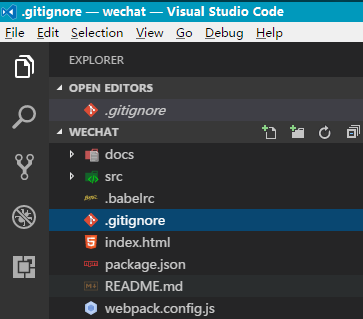

# 环境配置

## 环境安装
### Mac OS系统安装 brew
打开终端运行以下命令: 
/usr/bin/ruby -e "$(curl -fsSL 

> https://raw.githubusercontent.com/Homebrew/install/master/install)"

### Mac OS系统安装 nodejs:

> brew install nodejs

Windows 下直接下载安装包即可 
linux 下可以使用 apt-get（ubuntu） 或 yum（centos） 命令安装。 
具体可参考：http://www.runoob.com/nodejs/nodejs-install-setup.html

### 安装淘宝镜像

国内直接使用 npm 的官方镜像是非常慢的，这里推荐使用淘宝 NPM 镜像。

> npm install -g cnpm --registry=https://registry.npm.taobao.org

这样就可以使用 cnpm 命令来安装模块了：

> cnpm install [name]

### 安装webpack

> cnpm install webpack -g

### 安装vue脚手架

> npm install vue-cli -g

### 在硬盘上找一个文件夹放工程用的，在终端中进入该目录

> cd 目录路径

### 根据模板创建项目
> vue init webpack-simple 工程名字<工程名字不能用中文> 
或者创建 vue1.0 的项目 
vue init webpack-simple#1.0 工程名字<工程名字不能用中文> 
会有一些初始化的设置，如下输入: 
Target directory exists. Continue? (Y/n)直接回车默认(然后会下载 vue2.0模板，这里可能需要连代理) 
Project name (vue-test)直接回车默认 
Project description (A Vue.js project) 直接回车默认 
Author 写你自己的名字 

### cd 命令进入创建的工程目录
 
一定要从官方仓库安装，npm 服务器在国外所以这一步安装速度会很慢。 

> npm install

不要从国内镜像cnpm安装(会导致后面缺了很多依赖库) 

> cnpm install
